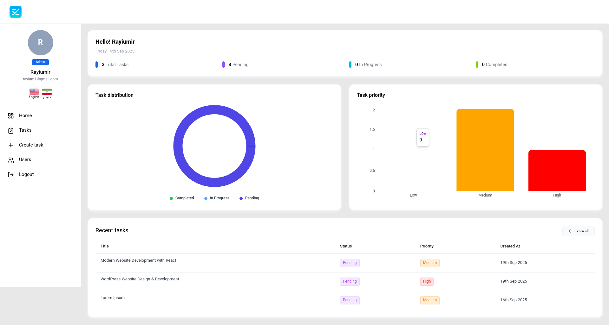
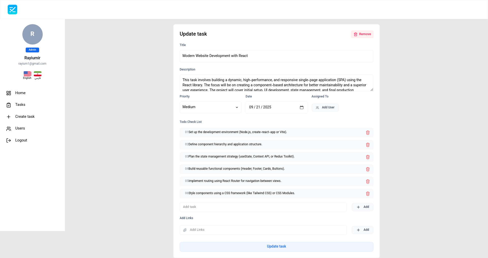
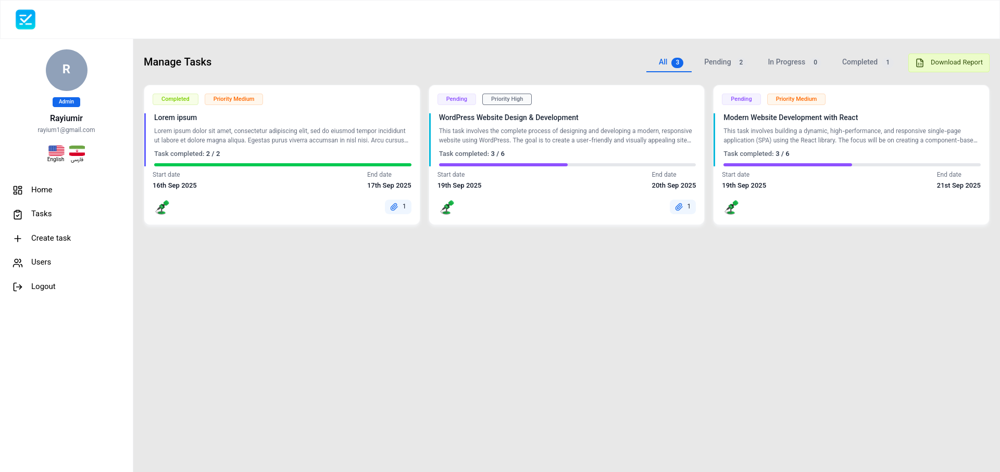
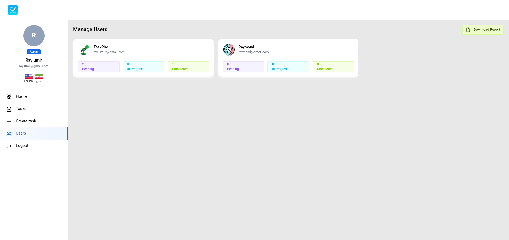
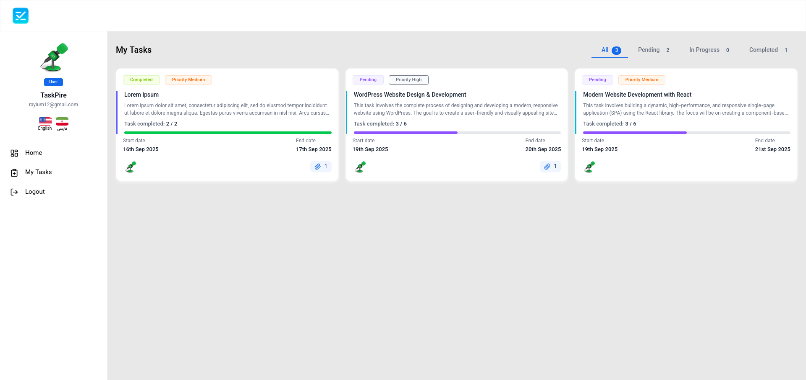
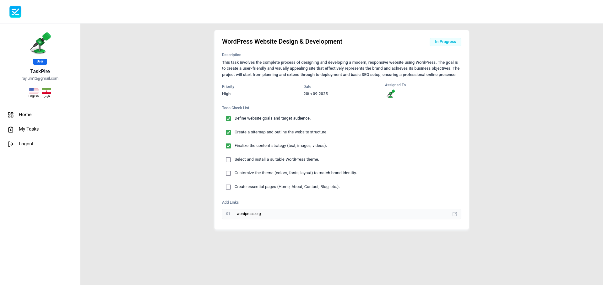

<p align="center">
    <picture>
        <source media="(prefers-color-scheme: dark)" srcset="./Logo/TaskPire_Dark.png">
        <source media="(prefers-color-scheme: light)" srcset="./Logo/TaskPire_Light.png">
        
    </picture>
</p>

# TaskPire

TaskPire is a task management tool built with React and Vite. It provides a simple and intuitive interface for managing tasks.

## Getting Started

To get started with TaskPire, clone the repository and install the dependencies:

```bash
https://github.com/Rayiumir/TaskPire.git
cd taskpire/
```

Running the backend server:

```bash
cd backend/
npm install
npm start
```

then, Running the frontend server:

```bash
cd frontend/TaskPire/
npm install
npm install vite --save-dev
npm run build
```

Open your browser and navigate to `http://localhost:5173` to see the app in action.

# Connection Database

To connect to the MongoDB database, you must complete the .env file with your database credentials.

```
MONGO_URI=mongodb://localhost:27017/MyProject
JWT_SECRET=your_JWT_SECRET
ADMIN_INVITE_TOKEN=4588944
PORT=5000
```

To create admin access, just change from `user` to `admin` in the `users` section in the `Role` column of the database.

## Contributing

We welcome contributions to TaskPire! If you'd like to contribute, please fork the repository and submit a pull request.

# Screenshots

### Admin

<table class="table">
<thead>
    <tr>
      <th scope="col" width="1000px">Admin Index</th>
      <th scope="col" width="1000px">Create Task</th>
      <th scope="col" width="1000px">Manage Tasks</th>
      <th scope="col" width="1000px">Users</th>
    </tr>
  </thead>
  <tbody>
    <tr>
      <td>
        
      </td>
      <td>
        
      </td>
      <td>
        
      </td>
      <td>
        
      </td>
    </tr>
  </tbody>
</table>

### User

<table class="table">
<thead>
    <tr>
      <th scope="col" width="1000px">User Index</th>
      <th scope="col" width="1000px">My Tasks</th>
      <th scope="col" width="1000px">Details Task</th>
    </tr>
  </thead>
  <tbody>
    <tr>
      <td>
        
      </td>
      <td>
        
      </td>
      <td>
        
      </td>
    </tr>
  </tbody>
</table>

